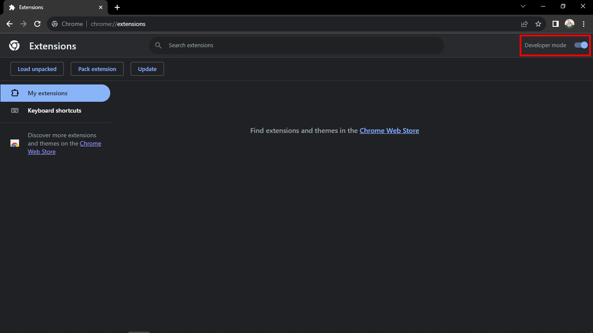
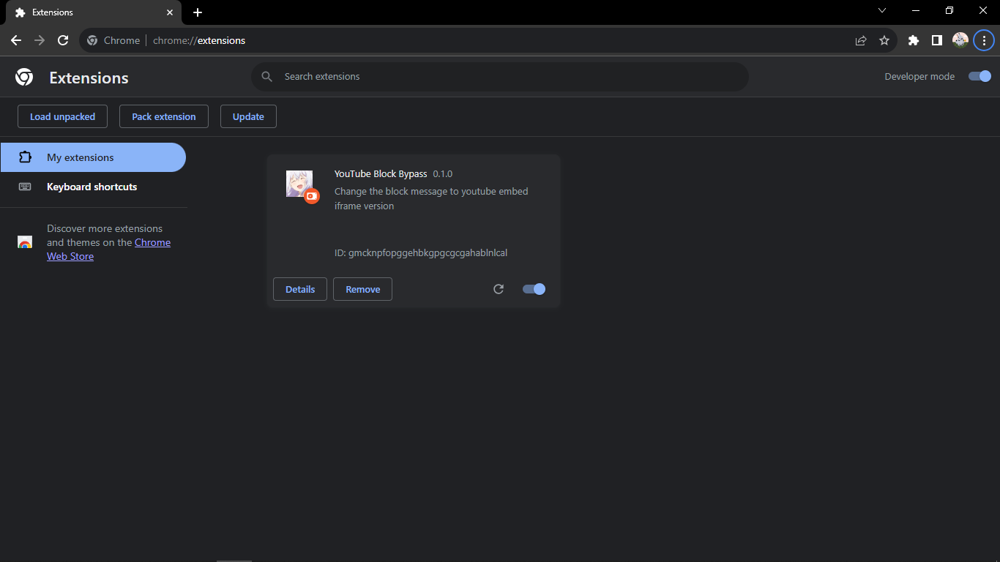

    
    <h1>YouTube Block Bypass   BETA</h1>

## What is this?

As you now know, [YouTube](https://www.youtube.com) is blocking users from accessing the video content for using ad blocker software. This [chrome extension](https://developer.chrome.com/docs/extensions/) is a way to still be able to watch the video content while using ad blocker software without any ads.

This project is still in early development. feel free to share your thought in the discussion.

## How does this extension work?

While youtube does blocking users from accessing the video, users still able to watch the video using [YouTube Video Embed API](https://support.google.com/youtube/answer/171780?hl=en). This extension work by getting the video id then replacing the warning message with the embedded video.

## What's the catch?

Most video are watchable but there are some feature that are absent from the video controller because the use of embed API.

## Is it safe?

Well, i'm as the one making this extension will say that this extension is safe, but it is up to you to believe me or not.

## How to install this extension?

### Chrome:

-   [Download](https://github.com/mangadi3859/youtube-block-bypass-extension/archive/refs/heads/main.zip) the zip file.

-   Extract the zip file.

-   Open chrome and go to [chrome://extension](chrome://extension).

-   Turn on **Developer Mode** in the top right corner.
    

-   Click **Load unpacked** button in the left corner. If this button doesn't show, make sure the developer mode is enabled.

-   You will be brought to the file explorer, find and select the file you just extracted. It should be a folder.

-   After that you should find an extension called **YouTube Block Bypass**
    

-   Now you can try to watch youtube.

### Note

Take a note that this extension will only work after you get completely blocked after the [**3 strikes**](https://www.androidauthority.com/youtube-three-strikes-policy-block-ads-3340340/)
